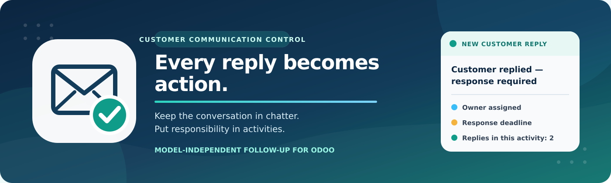
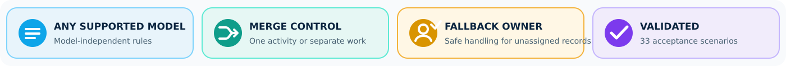

Customer Reply Activity for Odoo
================================

No customer or supplier reply goes unnoticed.

Customer Reply Activity turns an eligible external email reply into a clear
follow-up task for the person responsible for the related Odoo record. The
original message stays in chatter, while the activity provides an owner, a
deadline, the latest reply details, and a visible request to respond.

Documentation
-------------

Detailed documentation is included in the ``doc`` folder:

* `Complete User and Administrator Guide <doc/1.%20Complete%20User%20and%20Administrator%20Guide.pdf>`_
  — installation, configuration, daily use, examples, and troubleshooting.
* `Technical Architecture and Operations Guide <doc/2.%20Technical%20Architecture%20and%20Operations%20Guide.pdf>`_
  — mail integration, data models, security, reliability, monitoring, and
  deployment.
* `Testing, Acceptance, and Go-Live Guide <doc/3.%20Testing%20Acceptance%20and%20Go-Live%20Guide.pdf>`_
  — 33 repeatable scenarios, expected results, regression checks, rollout, and
  sign-off.

The guides are written for business users, system administrators,
implementation specialists, and technical support teams. They provide the
step-by-step detail required to configure and manage the module independently.

Full Technical Implementation and Testing Report
------------------------------------------------

The complete case study explains the standard Odoo incoming mail architecture,
the design decisions behind the module, assignment and merge logic,
automatic-message filtering, notifications, reliability controls, 23 validated
business and technical scenarios, and nine automated tests executed twice.

`Read the Full Technical Implementation and Testing Report on Google Drive <https://drive.google.com/file/d/1_UbEMkhX5ee5SE4RltZrWf81LV00pg_f/view?usp=drive_link>`_

What the Module Does
--------------------

Odoo normally stores incoming replies in chatter. This preserves the
conversation, but an important answer can still be missed among notes,
tracking values, internal comments, and other messages.

``mail_customer_reply_activity`` adds an action layer after the standard mail
route connects a reply to its business record. An eligible reply creates or
updates an activity with the summary
``Customer replied — response required``. The responsible user can immediately
see who replied, when the message arrived, and how many replies the activity
represents.

Configuration is model-independent. The module can be used with CRM
Opportunities, quotations, Sales Orders, invoices, Purchase Orders, warehouse
transfers, project tasks, and custom models that support chatter and
activities.

Key Features
------------

* Configurable rules for any supported non-transient model.
* ``Many2one`` and ``Many2many`` responsible fields linked to ``res.users``.
* Optional fallback responsible for records without an eligible primary owner.
* Configurable activity type and calendar deadline in days, weeks, or months.
* Merged replies in one open activity or a separate activity for every reply.
* One notification for creation and one reminder for every merged reply.
* Filtering for internal senders, excluded addresses, automatic replies, bulk
  mail, mailing lists, delivery reports, and mail loops.
* Standard Odoo chatter, activities, notification preferences, access rights,
  and completion behavior.
* Database protection against duplicate messages and concurrent merges.

Requirements and Installation
-----------------------------

The module can be installed in Odoo environments that allow custom Python
modules, including Odoo.sh, on-premise installations, and other self-hosted
deployments. Odoo Online does not support custom Python modules.

#. Copy ``mail_customer_reply_activity`` into an Odoo add-ons path.
#. Restart the Odoo service and update the Apps list.
#. Install **Customer Reply Activity**.
#. Open the rule configuration and create at least one active rule.

A working inbound mail route is required. Before configuring the module, send
an email from an Odoo record, reply from an external mailbox, and confirm that
the answer returns to the original record chatter.

An outgoing mail server is needed only for notifications delivered by email.
The activity can still be created and shown in Odoo when email delivery is not
enabled.

Configuration
-------------

Rules are available from either menu path:

* **Settings -> General Settings -> Discuss -> Customer Reply Activities**
* **Settings -> Technical -> Email -> Customer Reply Activities**

Only system administrators can manage rules. One active rule is allowed for
each model. Archive the current rule before activating its replacement.

Rule Fields
~~~~~~~~~~~

**Model**
  The model whose routed replies should create activities. Only non-transient
  models supporting chatter and activities are available.

**Responsible Field**
  A ``Many2one`` or ``Many2many`` field on the selected model pointing to
  ``res.users``. Only active internal users are eligible for assignment.

**Fallback Responsible**
  An optional active internal user used when the Responsible Field contains no
  eligible user. It is a second assignment level, not an additional recipient.

**Activity Type**
  An active generic activity type or one assigned to the selected model. The
  module includes a generic **Customer Reply** activity type.

**Reaction Time**
  A non-negative whole number of calendar days, weeks, or months added to the
  reply date in the responsible user's timezone. Zero means the current date.

**Merge Replies**
  Updates one matching open activity when enabled. Creates a separate activity
  for every eligible reply when disabled.

**Ignore Automatic Messages**
  Stops recognized automatic replies, bulk messages, mailing-list traffic,
  delivery reports, and mail loops from creating activities.

**Excluded Addresses**
  Sender addresses or patterns separated by new lines, spaces, commas, or
  semicolons. Matching is case-insensitive after sender normalization.
